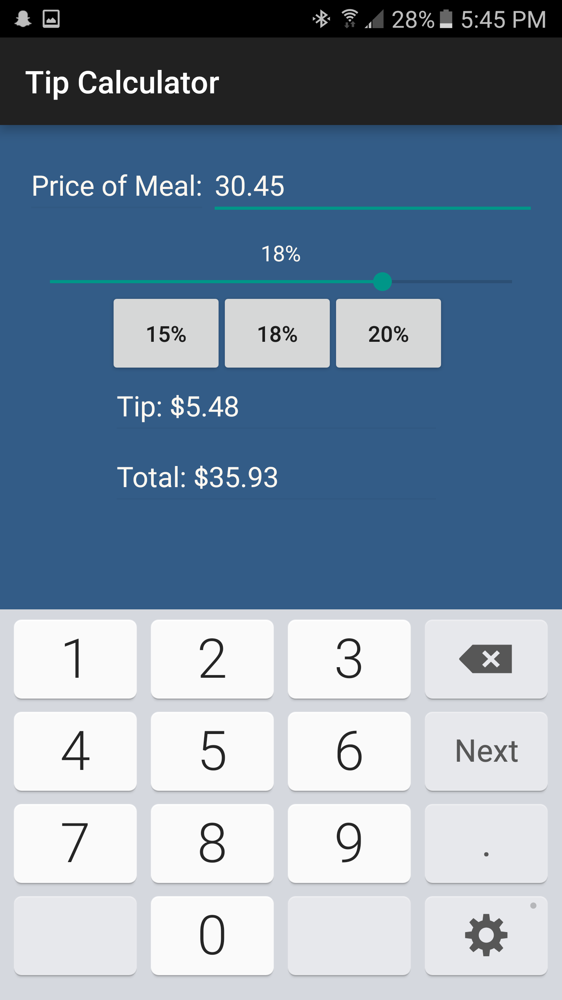
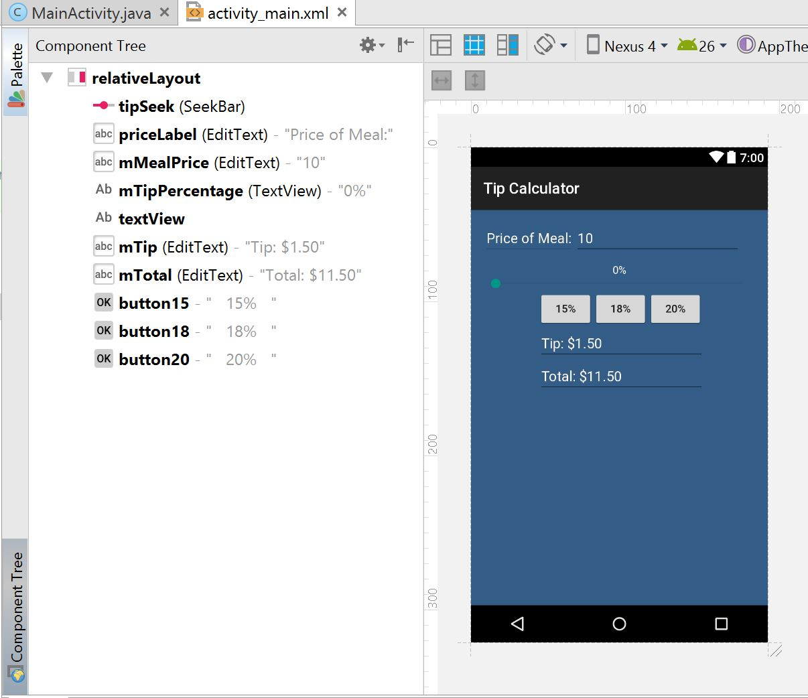

# Tip Calculator

<h2> Screenshot </h2>

 Tip Calculator allows the user to calculate the tip with a seek bar, from 0 to 25%, allowing for maximum precision. There are 3 default common tip percentages that allow the user to calculate the tip with a click of a button. 

 
<h2> High Level Design </h2>

